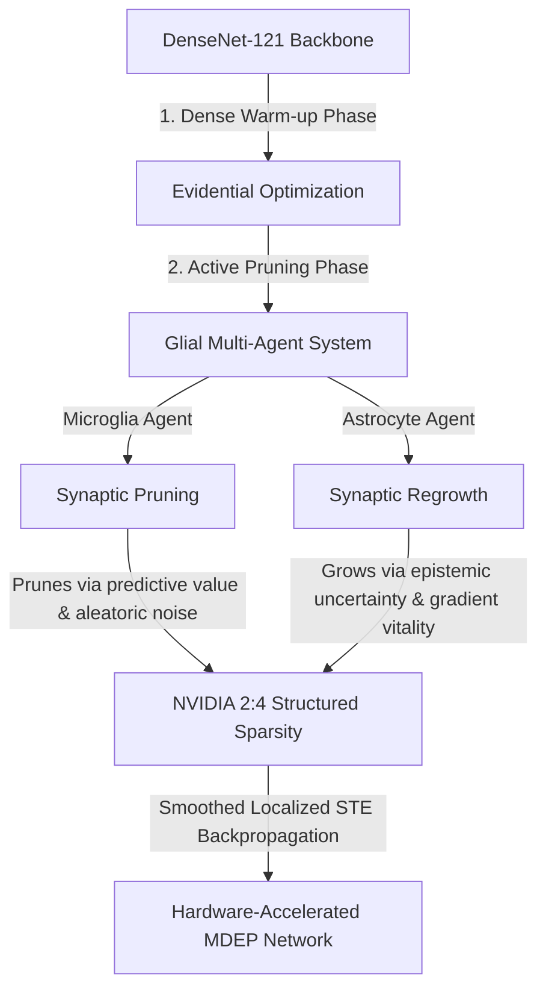

# MDEP: Microglial-Driven Evidential Pruning (DenseNet-121 Edition)

[](https://pytorch.org/)
[](https://developer.nvidia.com/blog/introducing-ampere-architecture-2-4-sparse-matrix-multiplication/)
[](https://opensource.org/licenses/MIT)
[]()

MDEP (**Microglial-Driven Evidential Pruning**) is a cutting-edge research framework that unites **Evidential Deep Learning (EDL)** and **Dynamic Sparse Training (DST)**. Inspired by biological glial mechanisms, this framework models structural network optimization as a continuous cooperative game between two glial agents: **Microglia** (for targeted synaptic pruning) and **Astrocytes** (for uncertainty-guided synaptic regrowth).

This repository contains the advanced implementation mapped to a **DenseNet-121** backbone. The DenseNet architecture resolves the problem of gradient dilution and Jacobian rank degradation seen in standard ResNets, ensuring high-fidelity uncertainty propagation directly to the glial agents. The method strictly adheres to the **NVIDIA Ampere 2:4 structured sparsity** constraint, guaranteeing a theoretical 2x Tensor Core acceleration with $\approx 50\%$ reduction in MACs.

---

## 🧬 Biological Paradigm & Glial Multi-Agent System

In mammalian brains, structural plasticity is continuously regulated by non-neuronal glial cells. MDEP emulates this via a localized agent-based system acting upon a dynamic, topological latent matrix $S_{ij}$.



### 1. DenseNet Feature Flow & Jacobian Preservation

Unlike standard residual networks, DenseNet concatenates feature maps from preceding layers. The feed-forward mechanism of our sparse DenseNet is formally defined as:

$$
h^{(l)} = \phi \left( \tilde{W}^{(l)} [h^{(0)}, \dots, h^{(l-1)}] + b^{(l)} \right)
$$

This concatenation channels feature activations $z_i^{(l)}$ directly to the Global Average Pooling layer and the terminal `EvidenceLayer` in a single step. Consequently, the Jacobian matrix of epistemic uncertainty $\mathbf{J}$ retains its full rank:

$$
\mathbf{J} = \frac{\partial u_e}{\partial z^{(l)}}
$$

This mathematical property ensures that Astrocyte agents remain hypersensitive to out-of-distribution (OOD) signals, especially for minority classes.

### 2. Microglia Agent (Targeted Pruning)

Microglia agents eliminate redundant synapses by evaluating weight utility ($C_{ij}$) via a dual-metric driving force involving predictive gradients and aleatoric noise sensitivity:

$$
C_{ij} = \text{Norm}\left( \left| W_{ij} \cdot \frac{\partial \mathcal{L}_{EFL}}{\partial S_{ij}} \right| \right) + \beta \cdot \text{Norm}\left( \left| W_{ij} \cdot \frac{\partial u_a}{\partial S_{ij}} \right| \right)
$$

### 3. Astrocyte Agent (Uncertainty-Guided Regrowth)

Astrocytes monitor neuronal nodes and release growth factors to resurrect dormant connections where neurons are "blind" (high epistemic uncertainty). The Astrocyte Growth Potential $G_{ij}^{(t)}$ is formulated as:

$$
G_{ij}^{(t)} = \text{Norm}\left( u_{e,i}^{(node)} \right) \times \text{Norm}\left( \left| \frac{\partial \mathcal{L}_{EFL}}{\partial S_{ij}} \right| \right)
$$

These two forces combine to update the continuous topological score $\Delta S_{ij} = C_{ij} + G_{ij}$, ensuring adaptive, uncertainty-aware network topology optimization.

---

## 🧮 Evidential Focal Loss (EFL) & Regularization

The framework optimizes a strictly mathematically derived Evidential Focal Loss, resolving label smoothing deadlock and preventing gradient suppression.

### Cross-Entropy Term

Utilizing the digamma function $\psi(\cdot)$, the evidential cross-entropy loss is formulated to optimize the Dirichlet parameters $\alpha_c = S_\alpha$:

$$
\mathcal{L}_{CE} = \sum_{c=1}^K y_c \left( \psi(S_\alpha) - \psi(\alpha_c) \right)
$$

### KL Divergence Regularization

To prevent penalizing the ground-truth class, we construct $\tilde{\alpha}_c = y_c + (1 - y_c) \alpha_c$. The KL divergence regularizes the network against uniform random noise distributions:

$$
\mathcal{L}_{KL} = \log\Gamma\left(\sum_{c=1}^K \tilde{\alpha}_c\right) - \sum_{c=1}^K \log\Gamma(\tilde{\alpha}_c) + \sum_{c=1}^K (\tilde{\alpha}_c - 1)\left[ \psi(\tilde{\alpha}_c) - \psi\left(\sum_{c=1}^K \tilde{\alpha}_c\right) \right]
$$

---

## 🏥 Clinical Diagnostic Suite & Evaluation Metrics

The framework incorporates specialized clinical and hardware metrics suitable for top-tier medical AI research, validated on highly imbalanced datasets (e.g., ISIC 2024 Skin Cancer Detection).

### 1. F2-Score Threshold Optimization

In clinical oncology, false negatives (missing malignant lesions) are catastrophic. MDEP automatically calibrates the decision boundary $\tau_{opt}$ by maximizing the $F_2$-Score rather than standard accuracy:

$$
F_2 = 5 \times \frac{\text{Precision} \times \text{Sensitivity}}{4 \times \text{Precision} + \text{Sensitivity}}
$$

The final clinical decision is generated according to this optimized threshold:

$$
\hat{y}_{clinical} = 1 \text{ if } \mathbb{E}[\pi_{malignant}] \ge \tau_{opt} \text{ otherwise } 0
$$

### 2. Minority Expected Calibration Error (Minority-ECE)

Standard ECE is heavily skewed by the healthy majority class. MDEP precisely quantifies calibration error exclusively on the malignant subset:

$$
\text{ECE}_{minority} = \sum_{m=1}^M \frac{|B_m|}{N_{minority}} \left| \text{acc}(B_m) - \text{conf}(B_m) \right|
$$

### 3. Ampere 2:4 MACs Reduction

The topological constraints enforced by the local Smoothed-STE result in exactly $50\%$ parameter survival per block. The theoretical computation cost (Multiply-Accumulate Operations) drops significantly:

$$
\text{MACs}_{sparse} = \frac{1}{2} \sum_{l=1}^L \left( C_{in}^{(l)} \times C_{out}^{(l)} \times K^2 \times H \times W \right) \approx 50\% \text{ MACs}_{dense}
$$

---

## 📂 Repository Structure

* **`mdep_agents.py`**: Implementation of `MDEPConv2d`, `MDEPLinear`, and the Glial score updating mechanics (`update_scores_agents`).
* **`losses.py`**: Implementation of the `EvidentialFocalLoss` and custom KL divergence regularizer.
* **`mdep_densenet_notebook.py`**: Complete, unified training/evaluation script utilizing DenseNet-121 and the full multi-agent system.
* **`mdep_densenet_ablation_prune_only.py`**: Ablation study script isolating the Microglia (Pruning) agent (Astrocyte disabled).
* **`mdep_densenet_ablation_grow_only.py`**: Ablation study script isolating the Astrocyte (Growing) agent.
* **`main_densenet.py`**: The multi-file modular entry point for DenseNet-121 training.
* **`trainer.py` & `edl_core.py`**: Training loop utilities and Core Evidential logic.

---

## 🚀 Usage Guide

### Installation
Ensure you have the required packages installed:

```bash
pip install torch torchvision pandas numpy scikit-learn matplotlib h5py
```

### Running the Full DenseNet Framework
Run the all-in-one notebook equivalent script for training and evaluation:

```bash
python mdep_densenet_notebook.py
```

### Running Ablation Studies
To isolate and validate the individual glial agent hypotheses:

```bash
# Evaluate Pruning (Microglia) without Regrowth
python mdep_densenet_ablation_prune_only.py

# Evaluate Regrowth (Astrocyte) focus
python mdep_densenet_ablation_grow_only.py
```

### Loading Pre-trained Models

```python
import torch
import torchvision.models as models
from main_densenet import replace_densenet_with_mdep

device = torch.device('cuda' if torch.cuda.is_available() else 'cpu')

# 1. Initialize standard DenseNet-121
model = models.densenet121(weights=None)
num_ftrs = model.classifier.in_features
model.classifier = nn.Sequential(
    nn.Linear(num_ftrs, 2),
    EvidenceLayer(activation='softplus')
)

# 2. Inject MDEP dynamic sparse components
replace_densenet_with_mdep(model)

# 3. Load checkpoints
model.load_state_dict(torch.load('model_checkpoint.pth', map_location=device))
model.eval()
print("MDEP-DenseNet-121 successfully loaded!")
```

---

## 🤝 Citation & Authorship

If you utilize this modified framework in your medical AI or neural network pruning research, please cite the upcoming paper corresponding to this repository.

*MDEP (DenseNet-121 Architecture) — Designed for High-Stakes Medical AI Environments.*
